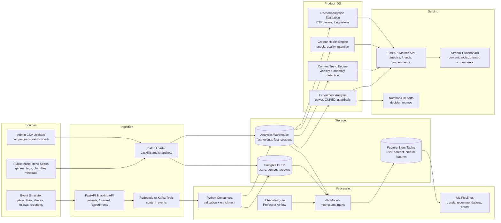
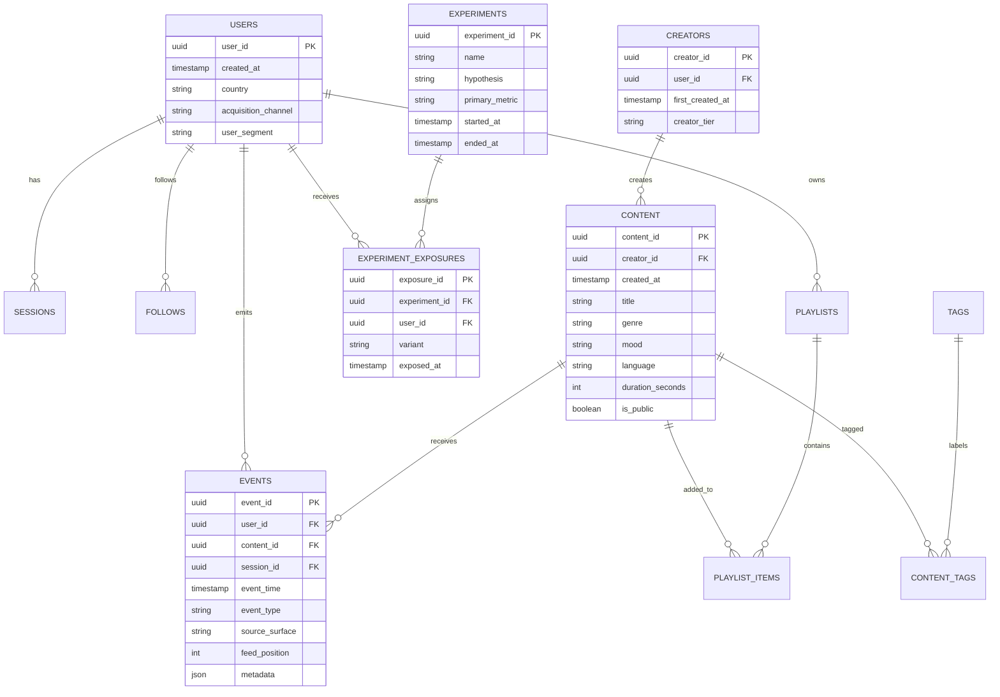

# Suno-Tailored Portfolio Project Plan

## Project Title

**SunoPulse: Real-Time Content, Social, and Creator Intelligence Platform**

## Why this project

This project is designed for the **Data Scientist, Content + Social** role at Suno.
The live job posting emphasizes content discovery, listening, playlisting, feed
engagement, social interactions, creator ecosystems, trend tracking, experiment
design, SQL, Python, statistical modeling, and product recommendations.

Source checked: Menlo Ventures job board, **Data Scientist, Content + Social at
Suno**, posted **April 14, 2026**:
https://jobs.menlovc.com/companies/suno-2-eb4ecbd1-b03a-4bdc-bddb-927c1bc18372/jobs/74219779-data-scientist-content-social

This should be presented as a **production-style portfolio project**, not as
employment experience. On LinkedIn and in interviews, describe it as:

> Built an end-to-end real-time analytics platform for a music/social content
> product, covering event ingestion, metrics design, creator supply health,
> content trend detection, experimentation analysis, and product dashboards.

## Interview Goal

The project should prove that I can do the work Suno is hiring for:

| Suno responsibility | What this project will show |
|---|---|
| Understand how users discover and engage with content | Discovery funnel, recommendation metrics, feed engagement, retention cohorts |
| Support social experiences and creator programs | Follow graph, shares, comments, remixes, creator lifecycle analytics |
| Track content trends and supply health | Trending songs, genre supply/demand balance, creator concentration, cold-start inventory |
| Design and analyze experiments | A/B testing framework, CUPED, power analysis, metric guardrails |
| Build strong data foundations | Event schema, warehouse tables, dbt models, tests, API docs |
| Use SQL, Python, and statistical modeling | Postgres, DuckDB/ClickHouse optional, pandas, scipy, statsmodels, scikit-learn |
| Communicate clearly with product and engineering | Product-facing dashboard, metrics glossary, experiment readout docs |

## One-Line Resume Bullet

Built **SunoPulse**, a production-style Python data science platform for a
music/social product, with real-time event ingestion, Postgres analytics models,
FastAPI services, experiment analysis, creator supply-health metrics, content
trend detection, and Streamlit executive dashboards.

## Architecture Diagram



## Product Concept

SunoPulse will behave like the analytics brain for an AI music platform:

- Users discover songs through a feed, search, playlists, profiles, and shares.
- Creators publish AI-generated songs with tags, prompt attributes, genre, mood,
  duration, language, and visibility settings.
- Social actions include follows, reposts, comments, saves, shares, collaborations,
  and remixes.
- The platform tracks whether discovery creates meaningful engagement:
  long listens, repeats, saves, follows, playlist adds, creator follows, and shares.
- Data science workflows answer practical product questions:
  Which feed experiences increase high-quality listening?
  Which creator segments are growing?
  Which genres have demand but not enough supply?
  Which social loops create durable retention?
  Which experiment variant should ship?

## Core Features

### 1. Real-Time Event Tracking

Build a FastAPI tracking service that accepts events such as:

- `song_impression`
- `song_play_start`
- `song_play_complete`
- `song_skip`
- `song_like`
- `song_save`
- `playlist_add`
- `share_created`
- `creator_follow`
- `comment_created`
- `song_created`
- `remix_created`
- `experiment_exposure`

Each event will be validated with Pydantic and written to a streaming topic or
directly to Postgres in local mode.

### 2. Content Discovery Analytics

Build metrics that a content/social data scientist would own:

- Impression-to-play rate
- Play-to-complete rate
- Long-listen rate
- Save rate
- Share rate
- Repeat-listen rate
- Playlist-add rate
- Feed position decay
- Search-to-play conversion
- Discovery source attribution
- New content cold-start performance
- Recommendation quality by segment

### 3. Social Analytics

Model social behavior with:

- Follow graph tables
- Creator-to-listener conversion
- Share invite funnel
- Comment and reaction quality
- Social discovery attribution
- K-factor style viral loop estimate
- Social retention lift versus non-social users

### 4. Creator Ecosystem Analytics

Track creator programs and supply health:

- New creators per day
- Activated creators: first song with meaningful engagement
- Creator retention by cohort
- Songs created per active creator
- Creator concentration and long-tail health
- Genre/mood/language supply mix
- Demand-to-supply gaps
- Creator quality score based on saves, completions, follows, and shares

### 5. Content Trend Engine

Detect content trends using Python:

- Rolling velocity score
- Week-over-week growth
- Bayesian smoothing for small samples
- Anomaly detection for fast-rising songs, genres, and creators
- Supply/demand imbalance alerts
- Trend explanations for product teams

Example trend insight:

> "Hindi lo-fi creator songs grew 42% week over week, but available supply is
> only 3.1% of feed inventory. Recommend increasing creator prompts, playlist
> surfaces, and onboarding examples for this category."

### 6. Experimentation Platform

Implement experiment analysis for content/social product changes:

- Randomized user assignment
- Exposure logging
- Primary metrics
- Guardrail metrics
- Minimum detectable effect calculator
- Sequential readout warnings
- t-test, bootstrap confidence interval, and CUPED adjustment
- Product recommendation report

Example experiment:

> Feed Ranking v2 increases long-listen rate by 3.8% with no negative movement
> in creator diversity, skip rate, or new-creator exposure. Recommend shipping
> to 50%, then monitoring long-tail creator share for seven days.

### 7. Recommendation Evaluation

Build an offline recommender evaluation module:

- Candidate generation using content tags, creator follows, and collaborative
  signals
- Ranking baseline using logistic regression or LightGBM
- Offline metrics: precision@k, recall@k, MAP@k, NDCG@k
- Product metrics: long listens, saves, shares, follows
- Diversity metrics: creator diversity, genre diversity, new-content exposure
- Cold-start analysis for newly created songs

This does not need to be a full production recommender. The goal is to show that
I understand how data science supports discovery systems.

### 8. Streamlit Product Dashboard

Create a polished dashboard with tabs:

- **Executive Overview**: DAU, active creators, songs created, listens, saves,
  shares, completion rate, supply health score
- **Content Discovery**: funnel, feed performance, source attribution,
  recommendation metrics
- **Social**: follows, shares, social retention, invite funnel, graph growth
- **Creators**: creator cohorts, activation, retention, creator quality, supply mix
- **Trends**: fast-rising songs, genres, tags, creators, anomaly alerts
- **Experiments**: experiment readouts, confidence intervals, recommendation

### 9. Metrics API

Expose analytics through FastAPI endpoints:

| Endpoint | Purpose |
|---|---|
| `POST /events` | Ingest product events |
| `GET /metrics/overview` | Executive platform metrics |
| `GET /metrics/content-funnel` | Discovery funnel metrics |
| `GET /metrics/social` | Social product metrics |
| `GET /metrics/creators` | Creator ecosystem metrics |
| `GET /trends/content` | Trending songs, tags, genres, creators |
| `GET /experiments/{experiment_id}` | Experiment result summary |
| `GET /recommendations/evaluation` | Offline recommender metrics |

### 10. Data Quality and Testing

Add tests that make the project credible:

- Unit tests for metric calculations
- Unit tests for experiment statistics
- Pydantic validation tests for event schemas
- SQL/dbt tests for uniqueness, not-null, accepted values, relationships
- API tests with pytest and httpx
- Dashboard smoke tests
- GitHub Actions CI

## Database Design



## Recommended Tech Stack

| Layer | Tool |
|---|---|
| Language | Python 3.12 |
| API | FastAPI, Pydantic |
| App dashboard | Streamlit |
| Database | Postgres for production-style work, SQLite fallback for easy demo |
| Analytics | pandas, SQLAlchemy, DuckDB |
| Statistics | scipy, statsmodels |
| ML | scikit-learn, optional LightGBM |
| Orchestration | Prefect |
| Streaming | Redpanda or Kafka, with local no-stream fallback |
| Transformations | dbt-core or SQL model scripts |
| Testing | pytest, httpx, coverage |
| Quality | ruff, mypy optional |
| Packaging | Docker, docker-compose |
| CI | GitHub Actions |
| Documentation | README, architecture docs, metrics glossary, experiment memo |

## Repository Structure

Recommended structure for the finished project:

```text
sunopulse/
├── README.md
├── docker-compose.yml
├── pyproject.toml
├── .env.example
├── docs/
│   ├── architecture.md
│   ├── metrics_glossary.md
│   ├── experiment_readout_example.md
│   └── linkedin_case_study.md
├── app/
│   ├── dashboard.py
│   └── pages/
│       ├── content_discovery.py
│       ├── social.py
│       ├── creators.py
│       ├── trends.py
│       └── experiments.py
├── api/
│   ├── main.py
│   ├── routes/
│   ├── schemas/
│   └── services/
├── ingestion/
│   ├── event_simulator.py
│   ├── stream_consumer.py
│   └── batch_loader.py
├── database/
│   ├── connection.py
│   ├── migrations/
│   └── seed.py
├── analytics/
│   ├── content_metrics.py
│   ├── social_metrics.py
│   ├── creator_health.py
│   ├── trends.py
│   ├── experiments.py
│   └── recommendations.py
├── models/
│   ├── recommender_baseline.py
│   └── churn_risk.py
├── notebooks/
│   ├── 01_metric_design.ipynb
│   ├── 02_content_trends.ipynb
│   ├── 03_experiment_analysis.ipynb
│   └── 04_creator_ecosystem.ipynb
├── tests/
│   ├── test_events.py
│   ├── test_content_metrics.py
│   ├── test_social_metrics.py
│   ├── test_creator_health.py
│   ├── test_experiments.py
│   └── test_api.py
└── scripts/
    ├── run_local_demo.sh
    ├── generate_demo_data.py
    └── create_demo_report.py
```

## Step-by-Step Build Plan

### Phase 0: Positioning and GitHub Story

1. Create a clear project name: **SunoPulse**.
2. Write a README that opens with the business problem, not the tools.
3. Add a "Why this matters" section focused on content discovery, social loops,
   creator health, and experimentation.
4. Add architecture diagrams and screenshots early.
5. Add a disclaimer that the project uses synthetic/product-modeled data and
   public metadata seeds, not private Suno data.

Deliverable:

- `README.md`
- `docs/architecture.md`
- `docs/metrics_glossary.md`

### Phase 1: Event Schema and Database Foundation

1. Define product events in Pydantic.
2. Create Postgres tables for users, creators, content, sessions, events,
   follows, playlists, experiments, and exposures.
3. Add seed data for users, creators, content, and tags.
4. Build database connection helpers.
5. Add unit tests for schema validation.

Deliverable:

- Working database schema
- `POST /events` contract
- Tests passing in CI

### Phase 2: Real-Time Ingestion

1. Build an event simulator that generates realistic music/social behavior.
2. Simulate sessions with feed impressions, plays, skips, saves, shares, and
   creator follows.
3. Add creator-side events such as song creation and remix creation.
4. Push events into Redpanda/Kafka in full mode.
5. Add a local direct-to-Postgres mode so reviewers can run the project easily.

Deliverable:

- A command that creates live-looking event data:

```bash
python scripts/generate_demo_data.py --users 5000 --days 60
```

### Phase 3: Core Metrics Layer

1. Build reusable metric functions in Python and SQL.
2. Create fact tables for sessions, content engagement, creator engagement,
   social events, and experiment outcomes.
3. Add metric definitions for discovery, social, creator, and supply health.
4. Write tests for every important metric.
5. Add a metrics glossary so product partners can understand the numbers.

Deliverable:

- `analytics/content_metrics.py`
- `analytics/social_metrics.py`
- `analytics/creator_health.py`
- `docs/metrics_glossary.md`

### Phase 4: Content Trend Detection

1. Build rolling aggregates by song, tag, genre, language, mood, and creator.
2. Calculate velocity, acceleration, and week-over-week growth.
3. Add Bayesian smoothing so tiny sample sizes do not dominate the trends page.
4. Add anomaly detection for sudden engagement spikes or supply gaps.
5. Return human-readable trend explanations.

Deliverable:

- `analytics/trends.py`
- Dashboard tab for fast-rising songs, creators, tags, and genres

### Phase 5: Creator Ecosystem and Supply Health

1. Define creator activation and retention.
2. Track creator cohorts by first creation week.
3. Build supply-demand balance metrics by genre, mood, and language.
4. Create a creator quality score with transparent weighting.
5. Flag categories where listener demand is high but creator supply is low.

Deliverable:

- Creator dashboard
- Supply health score
- Cohort retention chart

### Phase 6: Social Product Analytics

1. Build follow graph tables.
2. Measure how follows and shares affect discovery.
3. Compare retention for users who have social interactions versus users who do
   not.
4. Estimate social loop strength using share invite conversion and follow-back
   behavior.
5. Add social guardrail metrics for experiments.

Deliverable:

- Social dashboard
- Social retention analysis notebook

### Phase 7: Experimentation Analysis

1. Build deterministic user assignment into experiment variants.
2. Log experiment exposures.
3. Create an experiment analysis module.
4. Add power analysis and minimum detectable effect calculation.
5. Add CUPED-adjusted treatment effect estimation.
6. Create a product-facing experiment readout template.

Deliverable:

- `analytics/experiments.py`
- `docs/experiment_readout_example.md`
- Experiment dashboard tab

### Phase 8: Recommendation Evaluation

1. Build a simple candidate generator using genre, mood, creator, and social
   signals.
2. Train a baseline ranking model.
3. Evaluate with precision@k, recall@k, NDCG@k, save rate, long-listen rate,
   diversity, and cold-start exposure.
4. Compare baseline ranking against a personalized ranking approach.
5. Explain the product tradeoffs, not just model accuracy.

Deliverable:

- `analytics/recommendations.py`
- `models/recommender_baseline.py`
- Recommendation evaluation report

### Phase 9: API and Dashboard

1. Build FastAPI endpoints for metrics, trends, social, creators, and experiments.
2. Build Streamlit dashboard tabs.
3. Add filters for date range, user segment, source surface, genre, mood, and
   creator tier.
4. Add product recommendations beside the charts.
5. Add screenshots to the README.

Deliverable:

- Demo app that can run locally
- API docs at `/docs`
- Dashboard screenshots

### Phase 10: Polish for GitHub, LinkedIn, and Interviews

1. Add Docker Compose so reviewers can run the project quickly.
2. Add GitHub Actions for tests and linting.
3. Add a short demo video or GIF.
4. Add a LinkedIn case study document.
5. Add interview talking points and tradeoff discussion.
6. Add issues/milestones in GitHub to show professional project management.

Deliverable:

- Public GitHub repository
- LinkedIn post
- Resume bullets
- Portfolio case study

## Example Product Questions the Project Will Answer

1. Which discovery surface produces the highest long-listen rate?
2. Are shares creating new listeners or mostly circulating among existing users?
3. Which creator cohorts retain after their first successful song?
4. Which genres have strong listener demand but weak creator supply?
5. Does personalized ranking improve completion without reducing creator diversity?
6. Which experiment variant should ship and why?
7. Are new creators getting enough distribution in the feed?
8. Which content trends are early enough to act on?

## Metrics Glossary Preview

| Metric | Definition | Why it matters |
|---|---|---|
| Long-listen rate | Plays where user listens to at least 70% of song duration | Better quality signal than raw plays |
| Save rate | Saves divided by plays | Indicates durable user intent |
| Share rate | Shares divided by plays | Measures social spread |
| Creator activation | Creator publishes a song that receives a threshold of meaningful engagement | Measures whether creators reach value |
| Supply health score | Balance of active creators, content volume, diversity, and demand coverage | Shows whether the ecosystem is healthy |
| Feed diversity | Unique creators or genres shown per user/session | Prevents over-concentration |
| New-content exposure | Share of impressions going to recently created songs | Helps cold-start creators |
| Social retention lift | Retention difference for socially connected users versus isolated users | Measures community value |

## Example Experiment Readout

Experiment: **Feed Ranking v2**

Hypothesis:

> A ranking model that includes creator-follow affinity and recent trend velocity
> will improve meaningful listening without harming creator diversity.

Primary metric:

- Long-listen rate

Secondary metrics:

- Save rate
- Share rate
- Creator follow rate
- Playlist-add rate

Guardrail metrics:

- Skip rate
- New-creator exposure
- Creator diversity
- Genre diversity
- Session length outliers

Decision format:

```text
Recommendation: Ship to 50%

Why:
- Long-listen rate improved by 3.8%
- Save rate improved by 2.1%
- No statistically meaningful increase in skip rate
- New-creator exposure stayed within guardrail

Follow-up:
- Monitor creator diversity for seven days
- Break out impact by genre and new versus returning users
```

## LinkedIn Post Draft

```text
I built SunoPulse, an end-to-end real-time data science project for a music and
social content platform.

The project covers:
- Event tracking with FastAPI and Pydantic
- Postgres analytics schema for users, songs, creators, social actions, and experiments
- Content discovery metrics like long-listen rate, save rate, share rate, and feed conversion
- Creator ecosystem analytics for activation, retention, supply health, and demand gaps
- Trend detection for fast-rising songs, genres, tags, and creators
- A/B experiment analysis with guardrails, confidence intervals, and product recommendations
- Streamlit dashboard and API endpoints for product teams

I built it to practice the kind of data science used in content discovery,
social products, creator ecosystems, and experimentation.

GitHub: <repo link>
Demo: <demo link or video>
```

## GitHub README Opening Draft

```text
# SunoPulse

SunoPulse is a production-style data science platform for a music/social content
product. It models how users discover, listen to, save, share, and engage with
AI-generated songs, then turns those events into product metrics, creator
ecosystem insights, trend detection, recommender evaluation, and experiment
readouts.

The goal is to demonstrate the practical work of a content/social data scientist:
building reliable data foundations, defining useful metrics, analyzing product
experiments, tracking supply health, and communicating recommendations to
product and engineering teams.
```

## Interview Talking Points

Use these points when discussing the project:

- I started with the product questions, then designed the data model around them.
- I separated raw events from trusted metric tables because product teams need
  reproducible definitions.
- I used long-listen rate instead of raw play count because plays can be inflated
  by low-quality impressions.
- I included creator diversity and new-content exposure as guardrails because
  optimizing only for engagement can hurt the creator ecosystem.
- I added experiment analysis because shipping feed/social changes without
  causal measurement can lead to misleading conclusions.
- I kept a simple recommender baseline because the product tradeoff is often more
  important than model complexity.
- I wrote tests for metrics because a wrong metric can cause a wrong product
  decision.

## What Makes This Look Strong to Recruiters

- It is aligned to a real job posting.
- It uses Python, SQL, APIs, databases, metrics, statistics, and dashboards.
- It demonstrates product thinking, not just model training.
- It has a clear domain: content discovery, social engagement, and creators.
- It includes experiment design and decision-making.
- It can be demoed live.
- It has documentation, tests, and CI.
- It avoids pretending to use private company data.

## What I Will Build First

The strongest MVP path is:

1. Create the event schema.
2. Create the Postgres/SQLite schema.
3. Build the event simulator.
4. Build core metrics for content discovery.
5. Build the Streamlit dashboard overview.
6. Add trend detection.
7. Add experiment analysis.
8. Add creator health.
9. Add social analytics.
10. Add Docker, tests, screenshots, and LinkedIn polish.

This sequence gives a working demo quickly and then expands into the larger
portfolio project.

