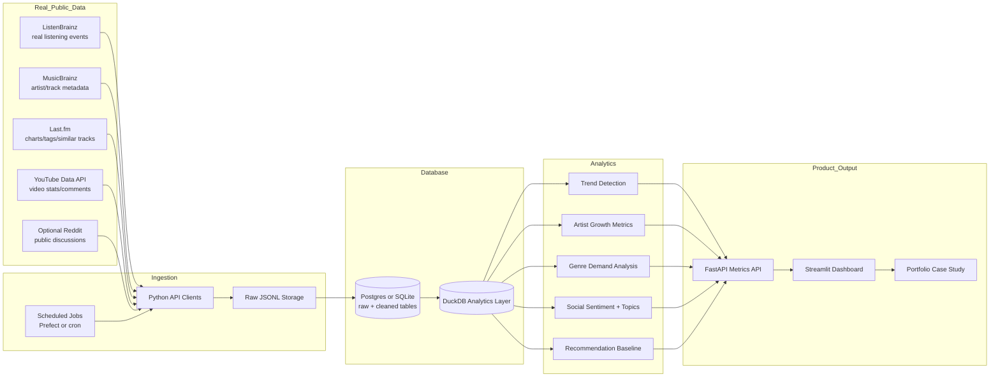
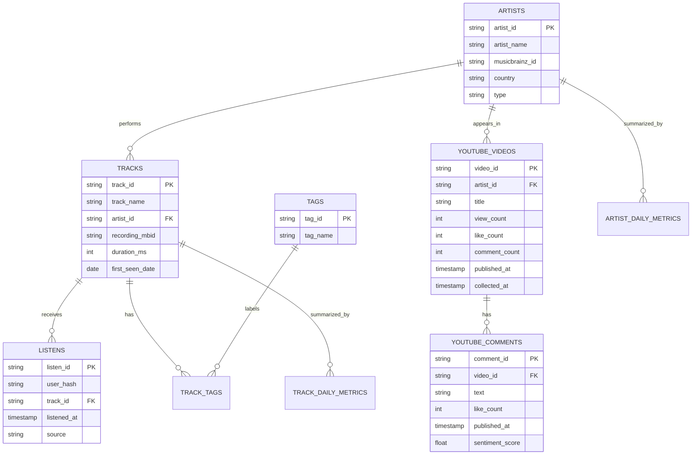

# Suno-Tailored Real Data Project Plan

## Simple Version

Build a **real music trend and social intelligence platform**.

Instead of fake users and fake songs, the project will use real public music data:

- Real listening history from **ListenBrainz**
- Real song, artist, release, and genre metadata from **MusicBrainz**
- Real track charts and tags from **Last.fm**
- Real public video stats and comments from **YouTube Data API**

The project will answer:

- Which artists, tracks, and genres are trending?
- Which songs are growing fastest?
- Which artists have strong listener demand?
- What are people saying in public comments?
- Which music categories are under-supplied or over-saturated?
- Can we recommend similar tracks or artists from real behavior?

This is much stronger than fake data because recruiters can see that the pipeline
works with messy real APIs and real datasets.

## Project Name

**SunoPulse Real Data: Music Trend, Social, and Creator Intelligence Platform**

## Important Truth

We cannot use Suno's private internal data, such as:

- Suno user sessions
- Suno feed impressions
- Suno skips
- Suno saves
- Suno creator payouts
- Suno experiments
- Suno recommendation logs

So the project will use **public real-world music data** to build the closest
portfolio version of what a Suno content/social data scientist would do.

## Real Data Sources

| Source | Real data we will use | Why it matters |
|---|---|---|
| ListenBrainz | Public listen dumps and listening events | Real user listening behavior |
| MusicBrainz | Artists, recordings, releases, genres, tags | Clean music metadata |
| Last.fm | Top tracks, top artists, tags, similar artists/tracks | Discovery and trend signals |
| YouTube Data API | Music video views, likes, comments, channel metadata | Public social engagement |
| Optional Reddit API | Public posts/comments about artists or genres | Extra social conversation signal |

## Architecture Diagram

## Database Tables

## What The App Will Show

### 1. Music Trend Dashboard

Charts:

- Fastest-growing tracks
- Fastest-growing artists
- Listen volume by day
- Genre/tag growth
- New artists breaking out
- Tracks with sudden spikes

Example insight:

> "Artist X grew 68% week over week on ListenBrainz and also saw a 22% increase
> in YouTube comment velocity."

### 2. Social Listening Dashboard

Charts:

- YouTube comment sentiment by artist
- Most-discussed artists
- Common topics in comments
- Positive/negative comment examples
- Comment velocity over time

Example insight:

> "Comments around Artist Y shifted positive after a new release, with recurring
> topics around vocals, production, and live performance."

### 3. Artist / Creator Growth Dashboard

Charts:

- Artist listen growth
- Track catalog size
- Listener concentration
- Rising artists by genre
- Artists with high comments but low listens
- Artists with high listens but low social discussion

Example insight:

> "Artist Z has strong listen growth but low YouTube discussion, suggesting
> discovery is happening through listening behavior rather than social buzz."

### 4. Recommendation System

Use real data to recommend:

- Similar tracks
- Similar artists
- Genre-based discovery
- Trending tracks by listener behavior

Possible methods:

- Co-listen similarity
- Tag similarity
- Artist similarity from Last.fm
- Hybrid score combining listens, tags, and trend velocity

### 5. API

Build FastAPI endpoints:

| Endpoint | Purpose |
|---|---|
| `GET /trends/tracks` | Fastest-growing tracks |
| `GET /trends/artists` | Fastest-growing artists |
| `GET /artists/{artist_id}/summary` | Artist performance summary |
| `GET /tracks/{track_id}/summary` | Track performance summary |
| `GET /social/youtube` | YouTube sentiment and comment metrics |
| `GET /recommendations/tracks/{track_id}` | Similar track recommendations |

## Step-by-Step Build Plan

### Phase 1: Data Source Setup

1. Get a Last.fm API key.
2. Get a YouTube Data API key.
3. Use MusicBrainz API with a proper user agent.
4. Download a sample of ListenBrainz public listen data.
5. Save all raw responses as JSONL so the project is reproducible.

Deliverable:

- API keys configured in `.env`
- Raw data folder
- First successful pulls from each source

### Phase 2: Database

1. Create tables for artists, tracks, listens, tags, YouTube videos, and comments.
2. Load ListenBrainz listens into the database.
3. Match artists/tracks to MusicBrainz metadata.
4. Attach Last.fm tags and chart data.
5. Attach YouTube stats/comments for selected artists or songs.

Deliverable:

- Real database with real music data

### Phase 3: Analytics

1. Calculate daily track listen counts.
2. Calculate daily artist listen counts.
3. Calculate week-over-week growth.
4. Detect trend spikes.
5. Calculate YouTube comment velocity.
6. Run sentiment analysis on comments.
7. Build artist and track scores.

Deliverable:

- Python analytics modules
- SQL queries
- Tested metric functions

### Phase 4: Dashboard

1. Build Streamlit dashboard.
2. Add filters for date range, artist, genre/tag, and source.
3. Add trend charts.
4. Add artist profile pages.
5. Add social sentiment charts.
6. Add recommendation results.

Deliverable:

- Recruiter-friendly interactive dashboard

### Phase 5: API

1. Build FastAPI app.
2. Add trend endpoints.
3. Add artist summary endpoints.
4. Add recommendation endpoints.
5. Add API docs.

Deliverable:

- Running API with real data behind it

### Phase 6: GitHub + LinkedIn Polish

1. Add README with screenshots.
2. Add architecture diagram.
3. Add data source documentation.
4. Add tests.
5. Add GitHub Actions.
6. Add a LinkedIn case study.

Deliverable:

- Public project that looks interview-ready

## Resume Bullet

Built **SunoPulse Real Data**, a Python analytics platform using public
ListenBrainz, MusicBrainz, Last.fm, and YouTube data to detect real music trends,
measure artist growth, analyze public social sentiment, expose FastAPI metrics,
and power a Streamlit product dashboard.

## Interview Pitch

> I wanted this project to use real data, not synthetic events. So I built a
> music trend intelligence platform using public listening data from
> ListenBrainz, metadata from MusicBrainz, tags and charts from Last.fm, and
> public YouTube engagement. The system ingests real API data, stores it in a
> relational database, computes trend and social metrics in Python/SQL, serves
> them through FastAPI, and visualizes them in Streamlit.

## What This Proves

- I can work with real APIs and messy public data.
- I can design a database for analytics.
- I can write Python data pipelines.
- I can build product metrics.
- I can analyze music/content/social behavior.
- I can build APIs and dashboards.
- I can explain insights clearly to product teams.

## First MVP

Build this first:

1. Pull top tracks from Last.fm.
2. Enrich those tracks with MusicBrainz metadata.
3. Pull related YouTube video stats/comments.
4. Store everything in SQLite or Postgres.
5. Show fastest-growing artists/tracks in Streamlit.
6. Add sentiment analysis for YouTube comments.
7. Add FastAPI endpoint for `/trends/artists`.

That MVP is enough to show real data, database, API, Python, analytics, and
dashboard work.

